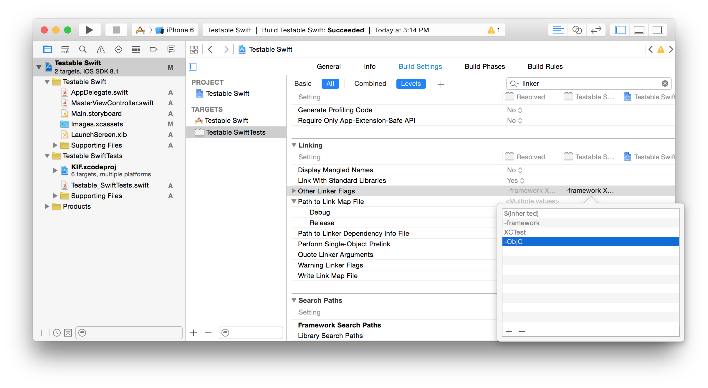

KIF iOS Integration Testing Framework
=====================================

KIF, which stands for Keep It Functional, is an iOS integration test framework. It allows for easy automation of iOS apps by leveraging the accessibility attributes that the OS makes available for those with visual disabilities.

*KIF uses undocumented Apple APIs.* This is true of most iOS testing frameworks, and is safe for testing purposes, but it's important that KIF does not make it into production code, because it will get your app submission denied by Apple. The instructions below help ensure that your project gets configured correctly.

Features
--------

#### Minimizes Indirection
All of the tests for KIF are written in Objective C. This allows for maximum integration with your code while minimizing the number of layers you have to build.

#### Easy Configuration
KIF integrates directly into your iOS app, so there's no need to run an additional web server or install any additional packages.

#### Test Like a User
KIF attempts to imitate actual user input as closely as possible. Automation is done using tap events wherever possible.

Installation
------------

To install KIF, you'll need to link the libKIF static library directly into your application. Download the source from the [KIF GitHub repository](https://github.com/square/KIF) and follow the instructions below.

*NOTE* These instruction assume you are using Xcode 4. For Xcode 3 you won't be able to take advantage of Workspaces, so the instructions will differ slightly.

### Add KIF to your project files
We'll add the KIF project into the ./Frameworks/KIF subdirectory of your existing app. If your project is stored in GitHub then you can use submodules to make updating in the future easier:

	cd /path/to/MyApplication
	mkdir Frameworks
	git submodule add git@github.com:/square/KIF Frameworks/KIF

If you're not using GitHub, simply download the source and copy it into the ./Frameworks/KIF directory.

### Add KIF to Your Workspace
Your app needs to know about KIF. The best way to do this is to add the KIF project into a workspace along with your main project.  Find the KIF.xcodeproj file in Finder and drag it into the Project Navigator (⌘+1). If you don't already have a workspace, Xcode will ask if you want to create a new one. Click "Save" when it does.

### Create a Testing Target
We'll create a second target for the KIF enabled version of the app to test. This gives us an easy way to begin testing (just run this second target), and also helps make sure that no testing code ever makes it into your App Store submission and gets your app rejected.

The new target will start as a duplicate of your old target. To create the duplicate target, select the project file for your app in the Project Navigator. From there, CTRL+click the target for your app and select the "Duplicate" option. Xcode may ask you if you want your copy to be for a different iOS device, which we don't, so choose "Duplicate Only". The new target will be created and you can rename it to something like "Integration Tests" if you wish.

You can also (optionally) rename the new target from the default "MyApp copy" to something like "MyApp (Integration Tests)" by selecting the "Build Settings" tab and searching for "Product Name", then changing the value to what you want.

### Configure the Testing Target
Now that we have a target for our tests, we need to add the tests to that target. With the project settings still selected in the Project Navigator, and the new integration tests target selected in the project settings, select the "Build Phases" tab. Under the "Link Binary With Libraries" section, hit the "+" button. In the sheet that appears, select "libKIF.a" and click "Add".

Next, we'll make sure that we can access the KIF header files. To do this, we'll add the KIF directory into the search path by adding the KIF directory to the "Header Search Paths" build setting. Start by selecting the "Build Settings" tab of the project settings. From there, use the filter control to find the "Header Search Paths" setting. Double click the value, and add the search path "$(SRCROOT)/Frameworks/KIF/" to the list. Mark the entry as recursive. If it's not there already, you should add the "$(inherited)" entry as the first entry in this list.

KIF takes advantage of Objective C's ability to add categories on an object, but this isn't enabled for static libraries by default. To enable this, add the "-ObjC" and "-all_load" flags to the "Other Linker Flags" build setting as shown below.

Finally, we'll add a preprocessor flag to our testing target so that we can conditionally include code. This will help us make sure that none of our testing code makes it into the production app. We'll call the flag "RUN_KIF_TESTS" and we'll add it under the "Preprocessor Macros." Again we'll want to make sure the "$(inherited)" entry is first in the list, 
- set RUN_KIF_TESTS=1

Example
-------
With your project configured to use KIF, it's time to start writing tests. There are three main classes used in KIF testing: the test runner (KIFTestController), a testable scenario (KIFTestScenario), and a test step (KIFTestStep). The test runner is composed of a list of scenarios that it runs, and in turn each scenario is composed of a list of steps. A step is a small and simple action which is generally used to imitate a user interaction. Three of the most common steps are "tap this view," "enter text into this view," and "wait for this view." These steps are included as factory methods on KIFTestStep in the base KIF implementation.

KIF relies on the built in accessibility of iOS to perform its test steps. As such, it's important that your app is fully accessible. This is also a great way to ensure that your app is usable by the sight impaired. Making your application accessible is usually as easy as giving your views reasonable labels. More details are available in .

Although not required, it's recommended that you create a subclass of KIFTestController that is specific to your application. This subclass will override the -initializeScenarios method, which will contain a list of invocations for the scenarios that your test suite will run. We'll call our subclass EXTestController, and will add an initial test scenario, which we will define later.

*KIFTestController.h*

	#import <Foundation/Foundation.h>
	#import "KIFTestController.h"

	@interface EXTestController : KIFTestController {}

	@end

*KIFTestController.m*

	#import "EXTestController.h"

	@implementation EXTestController

	- (void)initializeScenarios;
	{
	    [self addScenario:[KIFTestScenario scenarioToLogin]];
		// Add additional scenarios you want to test here
	}

	@end

The next step is to implement our scenario to test the login (+[KIFTestScenario scenarioToLogin]). We'll implement the scenarios as category class methods on KIFTestScenario. This will allow us to easily add on these category methods without needing additional subclasses, and the method name provides a unique identifier for referencing each scenario. Your KIFTestScenario category should look something like this:

*KIFTestScenario+EXAdditions.h*

	#import <Foundation/Foundation.h>
	#import "KIFTestScenario.h"

	@interface KIFTestScenario (EXAdditions)

	+ (id)scenarioToLogIn;

	@end

*KIFTestScenario+EXAdditions.m*

	#import "KIFTestScenario+EXAdditions.h"
	#import "KIFTestStep.h"
	#import "KIFTestStep+EXAdditions.h"

	@implementation KIFTestScenario (EXAdditions)

	+ (id)scenarioToLogIn;
	{
	    KIFTestScenario *scenario = [KIFTestScenario scenarioWithDescription:@"Test that a user can successfully log in."];
	    [scenario addStep:[KIFTestStep stepToReset]];
	    [scenario addStepsFromArray:[KIFTestStep stepsToGoToLoginPage]];
	    [scenario addStep:[KIFTestStep stepToEnterText:@"user@example.com" intoViewWithAccessibilityLabel:@"Login User Name"]];
	    [scenario addStep:[KIFTestStep stepToEnterText:@"thisismypassword" intoViewWithAccessibilityLabel:@"Login Password"]];
	    [scenario addStep:[KIFTestStep stepToTapViewWithAccessibilityLabel:@"Log In"]];
    
	    // Verify that the login succeeded
	    [scenario addStep:[KIFTestStep stepToWaitForTappableViewWithAccessibilityLabel:@"Welcome"]];
    
	    return scenario;
	}

	@end

Most of the steps in our scenario are already defined by the KIF framework, but +stepToReset is not. This is an example of a custom step which is specific to your application. Adding such a step is easy, and is done using a factory method in a category of KIFTestStep, similar to how we added our scenario.

*KIFTestStep+EXAdditions.h*

	#import <Foundation/Foundation.h>
	#import "KIFTestStep.h"

	@interface KIFTestStep (EXAdditions)

	+ (id)stepToReset;

	@end

*KIFTestStep+EXAdditions.m*

	#import "KIFTestStep+EXAdditions.h"

	@implementation KIFTestStep (EXAdditions)

	+ (id)stepToReset;
	{
	    return [KIFTestStep stepWithDescription:@"Reset the application state." executionBlock:^(KIFTestStep *step, NSError **error) {
	        BOOL successfulReset = YES;
        
	        // Do the actual reset for your app. Set successfulReset = NO if it fails.
        
	        KIFTestCondition(successfulReset, error, @"Failed to reset the application.");
        
	        return KIFTestStepResultSuccess;
	    }];
	}

	@end

The other line to notice in our sample scenario is the one that calls +[KIFTestStep stepsToGoToLoginPage]. This is an example of a convenient organizational technique which allows for easy code reuse. If you have a set of steps that are reused in a number of your scenarios, then you can group them together as a factory method that returns them as an array. Here's our KIFTestStep category again, this time including our step collection array:

*KIFTestStep+EXAdditions.h*

	#import <Foundation/Foundation.h>
	#import "KIFTestStep.h"

	@interface KIFTestStep (EXAdditions)

	// Factory Steps

	+ (id)stepToReset;

	// Step Collections

	// Assumes the application was reset and sitting at the welcome screen
	+ (NSArray *)stepsToGoToLoginPage;

	@end

*KIFTestStep+EXAdditions.m*

	#import "KIFTestStep+EXAdditions.h"

	@implementation KIFTestStep (EXAdditions)

	#pragma mark - Factory Steps

	+ (id)stepToReset;
	{
	    return [KIFTestStep stepWithDescription:@"Reset the application state." executionBlock:^(KIFTestStep *step, NSError **error) {
	        BOOL successfulReset = YES;
        
	        // Do the actual reset for your app. Set successfulReset = NO if it fails.
        
	        KIFTestCondition(successfulReset, error, @"Failed to reset some part of the application.");
        
	        return KIFTestStepResultSuccess;
	    }];
	}

	#pragma mark - Step Collections

	+ (NSArray *)stepsToGoToLoginPage;
	{
	    NSMutableArray *steps = [NSMutableArray array];
    
	    // Dismiss the welcome message
	    [steps addObject:[KIFTestStep stepToTapViewWithAccessibilityLabel:@"That's awesome!"]];
    
	    // Tap the "I already have an account" button
	    [steps addObject:[KIFTestStep stepToTapViewWithAccessibilityLabel:@"I already have an account."]];
    
	    return steps;
	}

	@end

Finally, we need to add a hook into the app so that it actually runs the KIF tests when executing the Integration Tests target. To do this we'll take advantage of the RUN_KIF_TESTS macro that we defined earlier. This macro is only defined in our testing target, so the tests won't run in the regular target. To invoke the test suite, add the following code to the end of your -application:didFinishLaunchingWithOptions: method in your application delegate:

	#if RUN_KIF_TESTS
	    [[EXTestController sharedInstance] startTestingWithCompletionBlock:^{
	        // Exit after the tests complete. When running on CI, this lets you check the return value for pass/fail.
	        exit([[EXTestController sharedInstance] failureCount]);
	    }];
	#endif

Everything should now be configured. When you run the integration tests target it will launch your app and begin running the testing scenarios. When the scenarios finish, the app will exit and return a zero if all scenarios pass, or the number of failures if any fail.

Troubleshooting
---------------

- Tapping table view cells - need to subclass and add isAccessibilityElement = YES

- Cannot find a view - Make sure it has the proper accessibility label
- Cannot find KIF classes or headers - Make sure .m file is included in correct target (only)

2011-06-13 13:54:53.295 Testable (Integration Tests)[12385:207] -[NSFileManager createUserDirectory:]: unrecognized selector sent to instance 0x4e02830
2011-06-13 13:54:53.298 Testable (Integration Tests)[12385:207] *** Terminating app due to uncaught exception 'NSInvalidArgumentException', reason: '-[NSFileManager createUserDirectory:]: unrecognized selector sent to instance 0x4e02830'

- Make sure to add library flags

Continuous Integration
----------------------

GitHub Markup
=============

We use this library on GitHub when rendering your README or any other
rich text file.

Markups
-------

The following markups are supported.  The dependencies listed are required if
you wish to run the library.

* [.markdown](http://daringfireball.net/projects/markdown/) -- `gem install redcarpet`
* [.textile](http://www.textism.com/tools/textile/) -- `gem install RedCloth`
* [.rdoc](http://rdoc.sourceforge.net/)
* [.org](http://orgmode.org/) -- `gem install org-ruby`
* [.creole](http://wikicreole.org/) -- `gem install creole`
* [.mediawiki](http://www.mediawiki.org/wiki/Help:Formatting) -- `gem install wikicloth`
* [.rst](http://docutils.sourceforge.net/rst.html) -- `easy_install docutils`
* [.asciidoc](http://www.methods.co.nz/asciidoc/) -- `brew install asciidoc`
* [.pod](http://search.cpan.org/dist/perl/pod/perlpod.pod) -- `Pod::Simple::HTML`
  comes with Perl >= 5.10. Lower versions should install Pod::Simple from CPAN.
* .1 - Requires [`groff`](http://www.gnu.org/software/groff/)

Contributing
------------

Want to contribute? Great! There are two ways to add markups.

### Commands

If your markup is in a language other than Ruby, drop a translator
script in `lib/github/commands` which accepts input on STDIN and
returns HTML on STDOUT. See [rest2html][r2h] for an example.

Once your script is in place, edit `lib/github/markups.rb` and tell
GitHub Markup about it. Again we look to [rest2html][r2hc] for
guidance:

    command(:rest2html, /re?st(.txt)?/)

Here we're telling GitHub Markup of the existence of a `rest2html`
command which should be used for any file ending in `rest`,
`rst`, `rest.txt` or `rst.txt`. Any regular expression will do.

Finally add your tests. Create a `README.extension` in `test/markups`
along with a `README.extension.html`. As you may imagine, the
`README.extension` should be your known input and the
`README.extension.html` should be the desired output.

Now run the tests: `rake`

If nothing complains, congratulations!

### Classes

If your markup can be translated using a Ruby library, that's
great. Check out Check `lib/github/markups.rb` for some
examples. Let's look at Markdown:

    markup(:markdown, /md|mkdn?|markdown/) do |content|
      Markdown.new(content).to_html
    end

We give the `markup` method three bits of information: the name of the
file to `require`, a regular expression for extensions to match, and a
block to run with unformatted markup which should return HTML.

If you need to monkeypatch a RubyGem or something, check out the
included RDoc example.

Tests should be added in the same manner as described under the
`Commands` section.

Installation
-----------

    gem install github-markup

Usage
-----

    require 'github/markup'
    GitHub::Markup.render('README.markdown', "* One\n* Two")

Or, more realistically:

    require 'github/markup'
    GitHub::Markup.render(file, File.read(file))

Testing
-------

To run the tests:

    $ rake

To add tests see the `Commands` section earlier in this
README.

Contributing
------------

1. Fork it.
2. Create a branch (`git checkout -b my_markup`)
3. Commit your changes (`git commit -am "Added Snarkdown"`)
4. Push to the branch (`git push origin my_markup`)
5. Create an [Issue][1] with a link to your branch
6. Enjoy a refreshing Diet Coke and wait

[r2h]: http://github.com/github/markup/tree/master/lib/github/commands/rest2html
[r2hc]: http://github.com/github/markup/tree/master/lib/github/markups.rb#L13
[1]: http://github.com/github/markup/issues